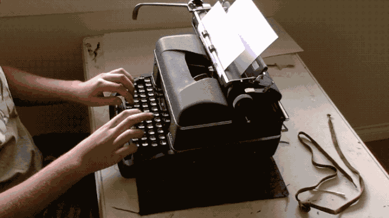

## 科普视频

> https://www.bilibili.com/video/av29259814?from=search&seid=7073405145873309500

## 回车键与换行键

我们很清楚的明白“回车键”指的是键盘上的 `enter` 键，当我们按下该键时会在文字处理软件中另起一行，由于现代计算机键盘演化于早期的英文打字机，所以在那个时期我们现在称谓的“回车键(enter)” 实际上是两个功能独立的按键：“回车键(CR,Return)” 与 “换行键(LF)”。

- “回车键（carriage return）”：也称之为 CR 或者 Return 键，其作用是让光标回到当前行的开头（类似于当光标在一行文字的任意位置时按下 home 键的效果）。
- “换行键（line feed）”：也称之为 LF，其作用时另启一行，光标在新行的行首。

当然，它们的作用要代入到“英文打字机”的实际使用场景中才能更容易理解，这里简单的介绍下早期英文打字机的使用原理：

在英文打字机上每个按键都对应着一个字模（这一点类似于活字印刷术），当按键被按下时，字模会被抬起然后敲击在纸张上，以实现文字打印。通常字摸的敲击位置是固定的，因此要想在纸张上从左至右的输入完一行，我们只能移动纸张，而移动纸张的模块我们可以很形象的理解为一辆马车拉着纸张，从而被称之为“字车”，当打字机不断的打印时，字车会随着文字的录入不断的移动以实现光标的前进，当打印完纸张上的一行时我们就需要按下打字机上的 “carriage return” 键（有些打字机可能没有该按键，通常为手动推动字车）以让字车回位（也即回到当前行的行首）。

当纸张的一行输入完毕后想输入下一行，光让字车回位回到行首是不够的，大多数打字机的两端会有一个手柄，通过按压手柄可以让打字机中的纸筒滚动以实现向上或向下垂直移动纸张，因此当纸张向上移动时就是插入一行，而这个手柄我们就可以形象的理解为 “line feed” 键。

这里我们可以简单的总结下，打字机上的回车键可以让纸张水平左右移动，而换行键则可以垂直移动纸张，具体效果如下图所示：



到了如今，早期打字机上的“回车键”与“换行键”已经合并为“Enter”键，其功能也合并成了回车同时换行，标识符号：↵，当现代文字处理软件遇到该符号时会同时回车并换行。

## \r\n 的由来

在打字机时代，我们可以将字母直接打印在物理介质的纸张上，当计算机发明出来后，我们则是通过存储介质来保存这些字符对应的二进制编码，因此键盘上的每个按键都有一个对应的字符编码：

- 换行符（LF）：\n ASCII 值为 `\x0a`
- 回车符（CR）：\r ASCII 值为 `\x0d`

由于计算机存储器在早期很贵，一些科学家认为在每行结尾加两个字符太浪费了，加一个就可以。于是，就出现了分歧。

- Unix 系统里：\n
- Window 系统里：\r\n
- Mac 早期系统里：\r
- Mac 新系统里(9+): \n

总的来说现在除 window 外，常用的回车符便是 `\n`，但在 window 系统下面，最好要进行以下兼容性处理：

```js
string.replace(/(\r)?\n/g, "\r\n");
```

## 参考文献

> http://www.ruanyifeng.com/blog/2006/04/post_213.html
